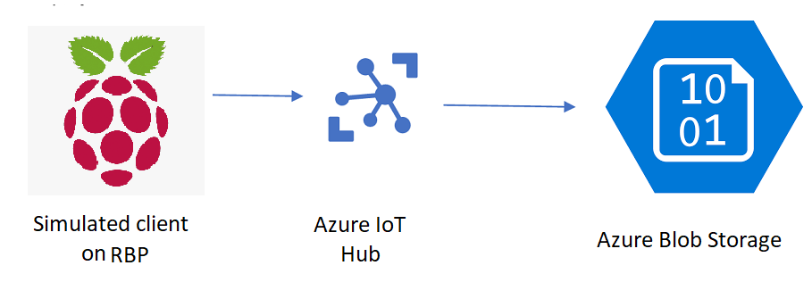

# Azure IoT Hands on Lab
In this lab, we  will use Azure Services for building an IoT solution connecting simulated devices to an Azure IoT Hub instance and store that data in a storage account.
This lab is composed of several modules that need to be perfomed in sequence.

In order to facilitate proper completion tracking and allowing better support from the instructors, please take a group name for several key resources. Your group name shall be `icaiiotgroupX`, where ***X*** is your group number (i.e. *icaiiotgroup1, icaiiotgroup2,..,icaiiotgroupN*)

## Modules

### Module 1: Creating an Azure IoT Hub
[Azure IoT Hub](iothub/README.md)

### Module 2: Creating a simulated device VM
[Device VM](device/README.md)

### Module 3: Creating a storage account
[Storage Account](storage/README.md)

### Module 4: Routing messages to the storage account
[Message Routing](routing/README.md)

