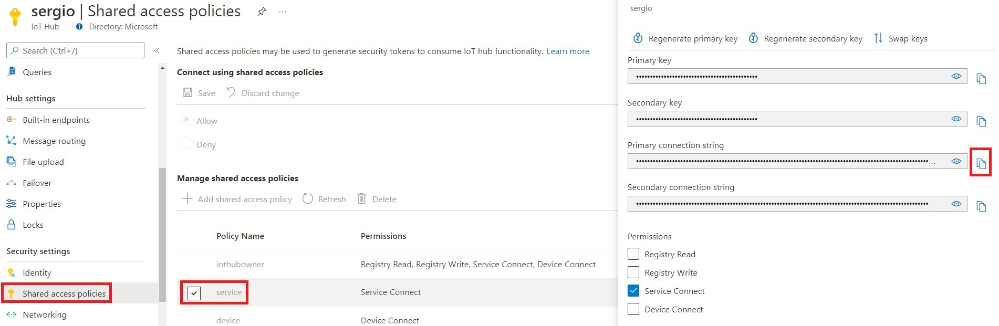

# Deploy a cloud to device messaging app

In this lab you will deploy a container to an Azure Container instance that allows for cloud to device messaging. 

# Get the Azure IoT Hub service key

You need to collect the Azure IoT Hub service keys, so you can provide it to the APP in the next step, so it can connect to your Azure IoT hub instance API securely. 

# Deploy the Azure Container instance template 

 

During deployment, the next image will show up.
You need to provide a unique name to your container instance and paste the key you collected in the previous point in the parameter IOT_HUB_CONNECTION_STRING

Once deployed, you need to collect the hostname of YOUR resulting application, as shown as an example in the FQDN field in the following image:

# Deploy the Azure Container instance template 

In the provided python script, you will need to update the parameter in the code where you define the hostname of your container application in the variable CONTAINER_HOSTNAME, as shown in the following snippet, with the previously obtained FQDN

You have a sample piece of logic you can now integrate in your application code for sending cloud to device messages
