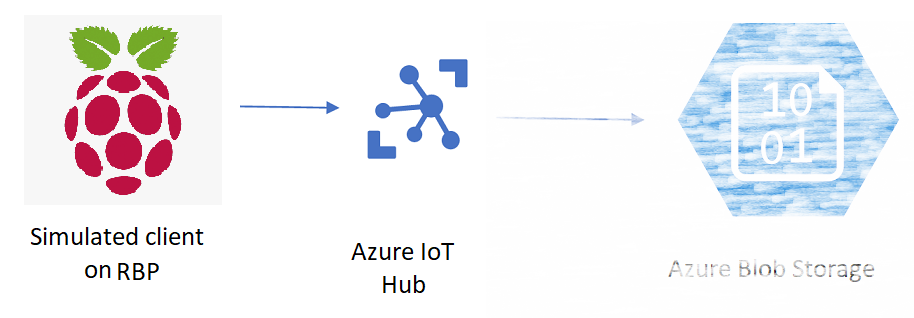
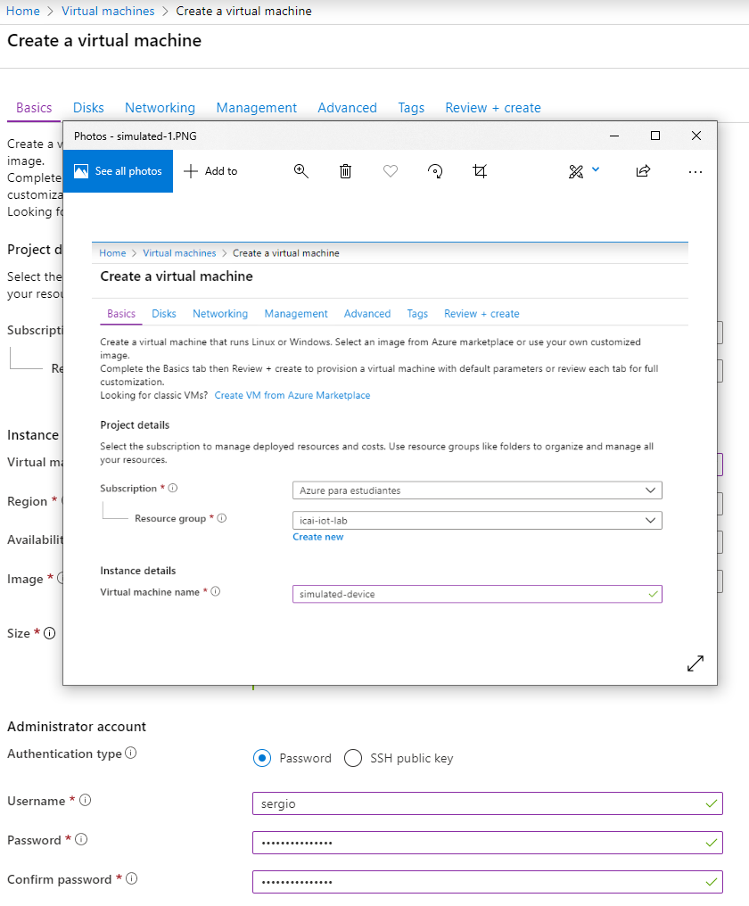
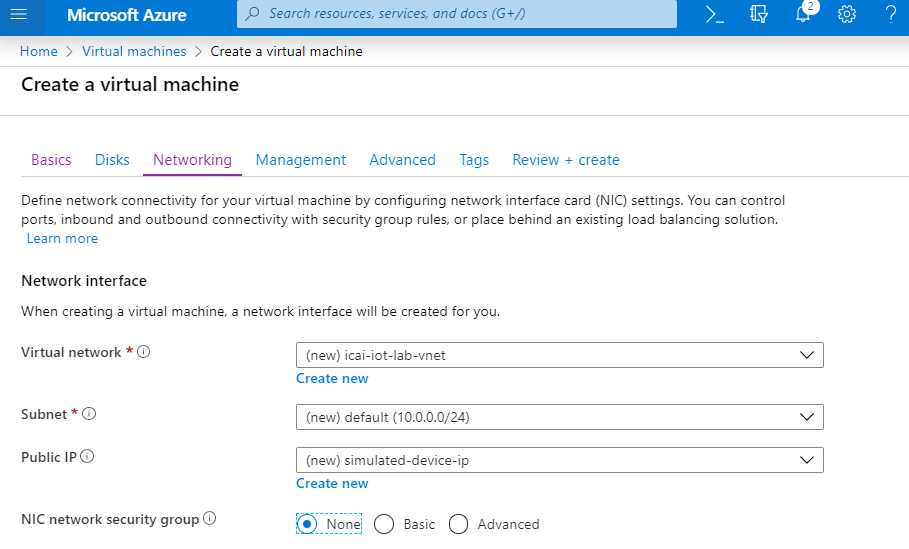
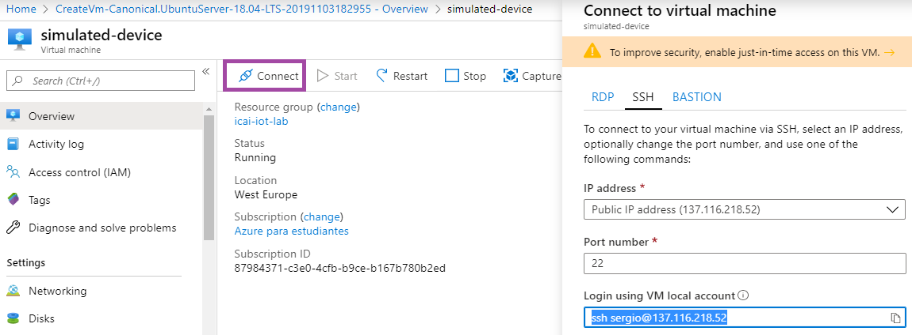
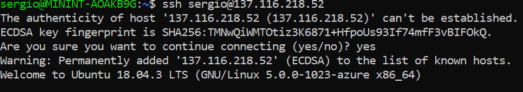
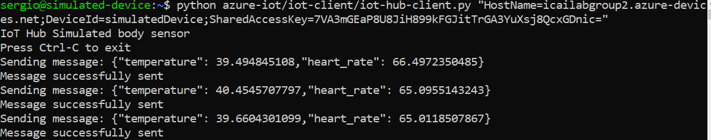
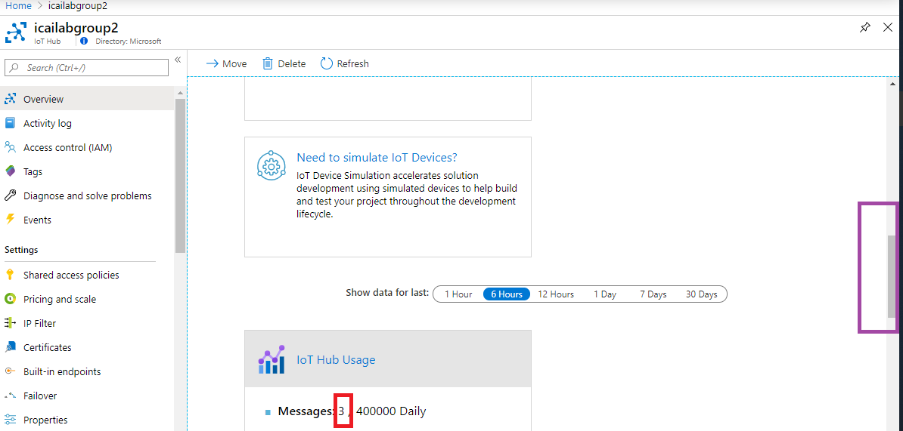

# Creating a device VM
In this module we will create a virtual machine, simulating a device that connects to Azure IoT Hub.

The outcome of this module is creating the simulated device VM element in the intended architecture below. Added to the IoT Hub instance in the previous module, we get the following partial architecture


## In the search window, look for "Virtual Machines" and press "New"


## Parameterize virtual machine basics
- Use the previously created resource group
- Name the VM
- Select Region "West Europe"
- Put your user and password. Optionally, if you are familiar with public/private keys, input your public key
- Select the VM size B1s, the one included in the free tier. Press "Change Size" and select "B1s"



## Remove network security rules
In order to facilitate Azure IoT hub communications, we are going to disable Network Security Groups. For this, in the Networking tab, select "Nic network security group" to "None", as shown in the following image



## Validate the VM creation
Once the VM configuration is OK, the following green mark will show up, so the VM creation can be triggered. Click "Create" if you see "Validation passed". It not, verify any missing parameters"


## VM is already created
After a few minutes, the VM should be running, as shown in the following snapshot


## Get the SSH connection string
In the previous snapshot, click "Go to resource". Select "Connect" in the following menu. A lateral blade with the connection details will show up, as shown below


## Connect to the VM via SSH
When connecting to the VM, accept the VM public key by inputing "yes", as shown below


Once connected, a command promt like the following will show up:


## Install required packages and repos
Execute the following commands. Try to make sense at what those commands do
```
sudo apt-get update -y
sudo apt install python-pip -y
pip install azure-iot-device
git clone https://github.com/SeryioGonzalez/azure-iot.git
```
## Send data to Azure IoT Hub using the device connection string of Module 1
After downloading the repo, the python script for sending data to IoT Hub is located in the iot-client folder.
Remember to put the connection string between quotes, otherwise the linux bash will interprete it

`sergio@simulated-device:~$ python azure-iot/iot-client/iot-hub-client.py `**`"HostName=icaiiotlabgroup2.azure-devices.net;DeviceId=simulatedDevice;SharedAccessKey=7VA3mGEaP8U8JiH899kFGJitTrGA3YuXsj8QcxGDnic="`**



## Verify the Azure IoT hub is receiving your messages
In order to see if Azure IoT Hub is receiving your messages, check the message counter in the Azure IoT hub module, as shown in the following snapshot highlighted in red.
You might need to scroll down the menu on the right hand side in purple. 
You can see, IoT Hub has received 3 messages.



At this point, this module is done. Go to the next module for continuing the lab and do something useful with this data
[Go back to the main section](../README.md )
