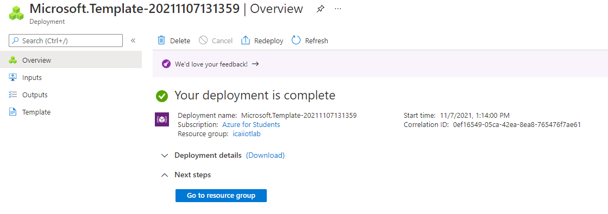

# Create resources for last cloud lab day

## Deploy the template
Use the following link for launching all resources.  

This is a template that deploys:
- Ubuntu VM as a sensor with required snippets
- A storage account 
- An IoT Hub with routing information to the storage account

  

In the image, you can see important information:
- The **Resource Group** (In black), the resource group to be used. For consistency, use **icaiiotlab**. If not created, please create it
- The **Region** (In red), select **West Europe**
- **Group Number** is your group to be used
- **Admin User Password** is the password of the simulated device. **DO NOT FORGET IT!!!**

Upon success after a few minutes, the following image will show-up: 

## Create an IoT hub device identity

In the previous image, click in **Go to resource group** and select the **IoT Hub** instance created. 
In the left pane, select the option **Devices**, as highlighted in red in the following image and click in **Add Device**, as shown in blue:

