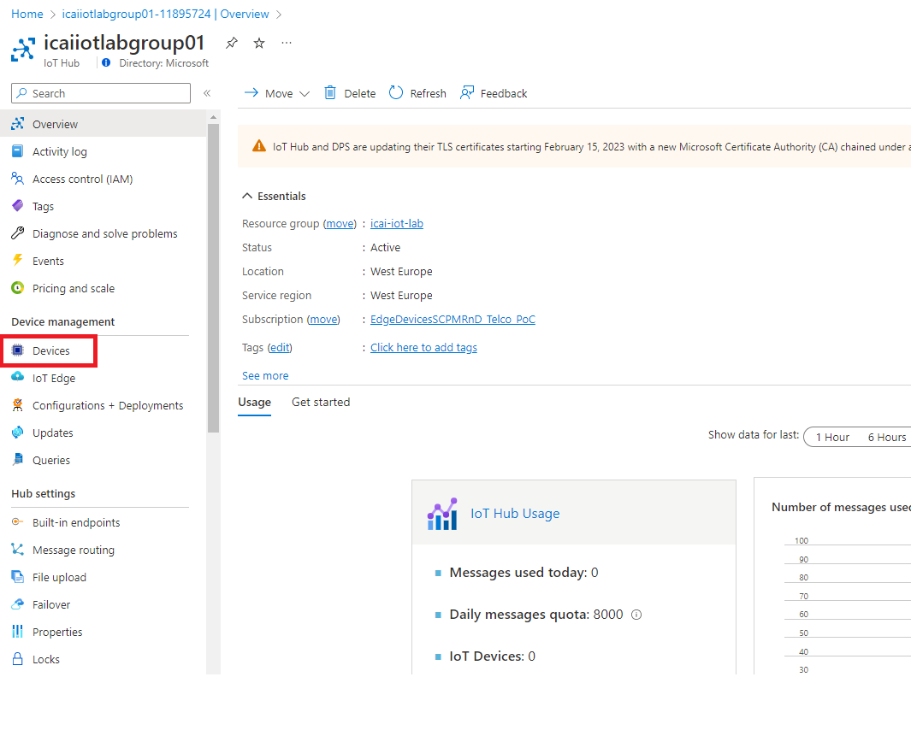
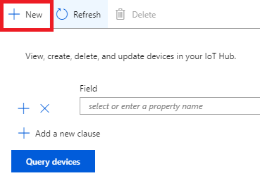

# Creating an IoT Hub
In this module we will create an Azure IoT Hub and configure a device

## Look for the Azure IoT lab icon in the search area of the Azure portal

## Create an Azure IoT Hub instance

#### Parameterize Azure IoT Hub instance parameters
Select your subscription. Create a resource group, for this project, name "icai-iot-lab". Select region "West Europe". Assign an Azure IoT Hub instance name "iotlabgroupX", where X is your group number. Click in "Size and scale" in order to set the proper service tier.

#### In the following diagram, remember to select "Free tier", which allows for 8000 free messages per day

#### Select "review + create". Upon successful validation, click "Create" and wait for a few minutes for the creation process to complete

#### Once the creation process has completed, the following window will show up

#### Press "Go to Resource" in the previous image and a window like the following will show up

#### At this state, the Azure IoT Hub module is created and ready to work. Next is to provision a device
[Go back to the main section](../README.md )

## Create a device identity in Azure IoT hub
Click in "IoT Devices" in the icon highlighted in read in the previous diagram. A window like the one below will show up. Click in "New", as highlighted in read in the image below

In the "Device ID" field, enter a name for your device. Select the default options highlighted, such as "Symmetric key" and "Auto-generate keys" 

Once created, click on the device just provisioned in order to get the device details. Select the primary connection string and store this information for following modules. You can obtain this information by clicking in the icon highlighted in red in the following figure.

