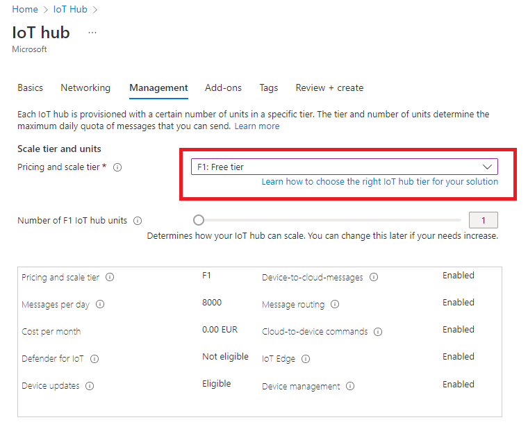
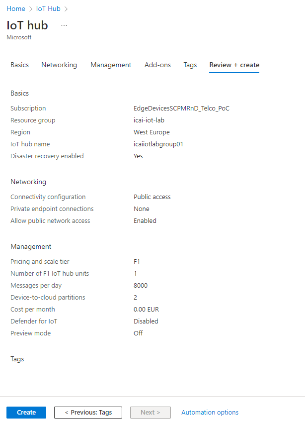

# Creating an IoT Hub
In this module we will create an Azure IoT Hub and configure a device

## Look for the Azure IoT lab icon in the search area of the Azure portal

## Create an Azure IoT Hub instance

#### Select your subscription. Create a resource group, for this project, name "icai-iot-lab". Select region "West Europe". Assign an Azure IoT Hub instance name "iotlabgroupX", where X is your group number. Click in "Size and scale" in order to set the proper service tier.

#### In the following diagram, remember to select "Free tier", which allows for 8000 free messages per day

#### Select "review + create". Upon successful validation, click create and wait for 

#### Click "Create" and wait for a few minutes for the process to complete

#### Once the creation process has completed, the following window will show up

