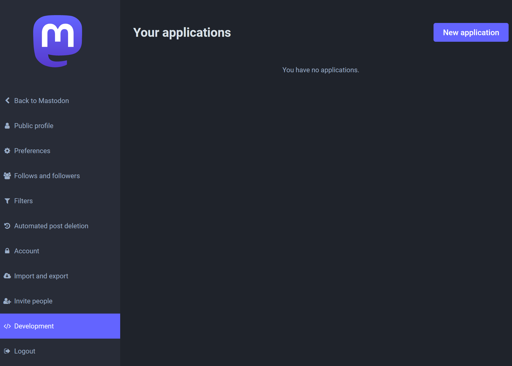
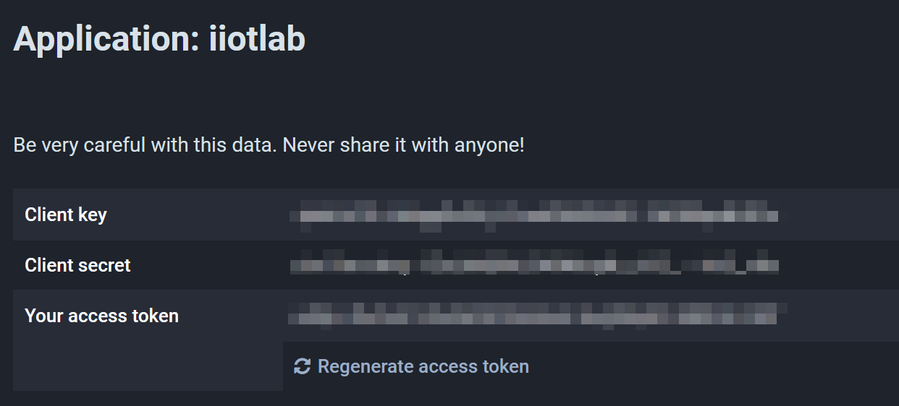
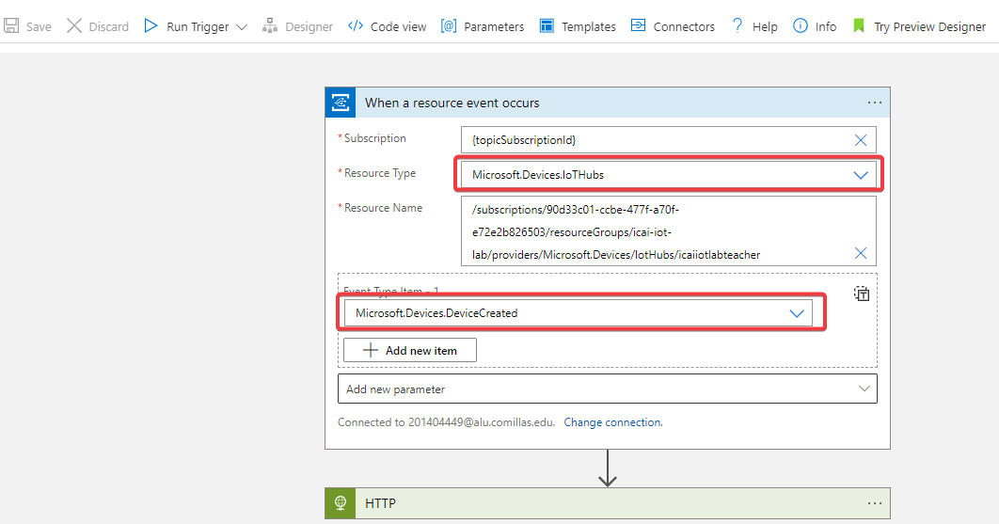
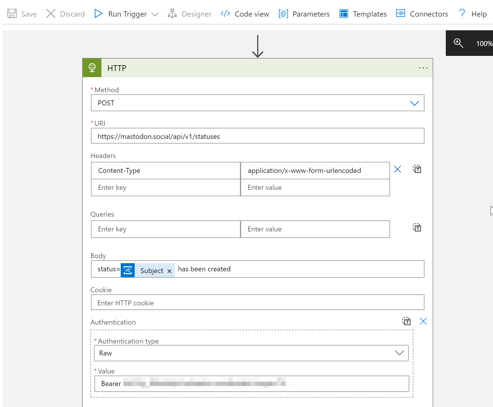
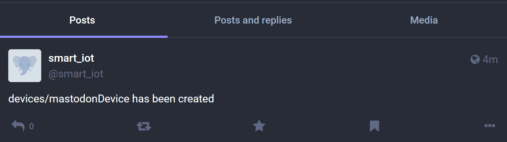

# React to Critical Device Lifecycle Events and Trigger Actions

Azure IoT Hub integrates with Azure Event Grid so that you can send event notifications to other services and trigger downstream processes. Configure your business applications to listen for IoT Hub events so that you can react to critical events in a reliable, scalable, and secure manner. For example, build an application to perform multiple actions like updating a database, creating a ticket, and delivering an email notification every time a new IoT device is registered to your IoT hub.

In this lab you will learn how to create logic app to be able to post Mastodon messages

## Create a Mastodon account
If you don't have a Mastodon account or don't want to use your personal account, go to [https://mastodon.social](https://mastodon.social) and create a free account. 

Once you have created your Mastodon Social account, go to Preferences --> </> Development and create a new application to get your access token. 

Once created, you should see your key, secret, and access token. The only thing we will use is the **Access token**.

**Please, check the "Scopes" of your app and make sure that you enable "write:statuses". Without this, you will not be able to publish posts. Then, save changes.** 

## Create Logic App from Azure IoT Hub

To use Logic Apps within our Azure IoT Hub, first we have to search for "Logic Apps" in the search bar of Azure Portal. Then create a logic app called "testApp", using your resource group and located in West Europe. Azure makes you create this first Logic App in order to be able to create logic apps within you IoT Hub, but bear in mind that **this logic app you have created will not be used, it is only to be able to use this feature**. 

After this, **Navigate to your Azure IoT hub** and select the option **Events** and click in **Logic Apps** as shown in the image below.

## Create a workflow within the Logic App
Access the logic app designer of the instance you have created and complete the form as shown in the following image, adding **HTTP** as the next step, by pressing the **Continue** button.

As you can see bellow, you need:
- **Resource Type** to **Microsoft.Devices.IoTHubs**
- **Event Type Item - 1** to **Microsoft.Devices.DeviceCreated**

This means that the Logic App will monitor the devices within the IoT Hub you created and and trigger the app when a new device is created.

Please note the exemplary nature of this lab. As you can see, there some other options you can use for your project. 

Once you have the first step of your app, add the following step: HTTP and configure it as the image below: 

.

What are we doing here? We are using the API of mastodon. We will use the HTTP method POST to send the information we want to publish. For this reason, we have to specify the URI, indicate the Content-Type as a header, and, in the body, specify what we want to publish in Mastodon by putting "status" before the content, as the previous image shows. 

"Subject" makes reference to the content of the previous step, that is, the name of the new device that has been created, which is the action that was configure to trigger this app. 

However, you cannot post in Mastodon without using your account, so you need to authenticate yourself in the HTTP POST. This is done by adding Authentication paramenter at the end of the HTTP box in Logic Apps, selecting "Raw" as authentication type, and,as value, "Bearer (yousecretaccesstoken)"

Once you have configured everything, click **Save as** in the upper left corner of the Logic App editor and input a **Logic app name** of your choice.

Once the Logic App has been succesfully saved, go create a device in IoT Hub, in this example, I created a device called **mastodonDevice** and the result is as follows:

