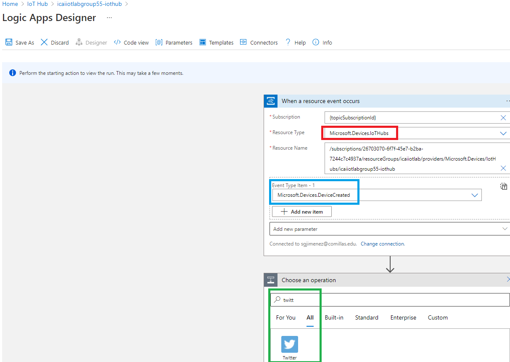
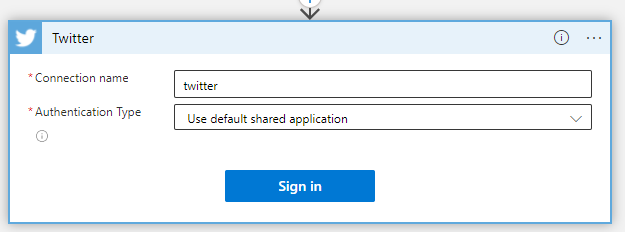
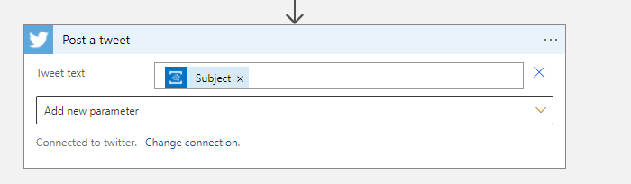

# React to Critical Device Lifecycle Events and Trigger Actions

Azure IoT Hub integrates with Azure Event Grid so that you can send event notifications to other services and trigger downstream processes. Configure your business applications to listen for IoT Hub events so that you can react to critical events in a reliable, scalable, and secure manner. For example, build an application to perform multiple actions like updating a database, creating a ticket, and delivering an email notification every time a new IoT device is registered to your IoT hub.

In this lab you will learn how to create logic app to be able to send Twitter tweets

## Create Logic App from Azure IoT Hub

Navigate to your Azure IoT hub and select the option **Events** and click in **Logic Apps** as shown in the image below.

## Create a workflow within the Logic App
Once the Logic App instance has been created, you need to sign in to Azure Event Grid and complete the form as shown in the following image, adding **Twitter** as the next step, by pressing the **Continue** button.

As you can see bellow, you need:
- **Resource Type** to **Microsoft.Devices.IoTHubs**
- **Event Type Item - 1** to **Microsoft.Devices.DeviceCreated**

Please not the exemplary nature of this lab. As you can see, there some other options you can use for your project

Select the option **Post a tweet**.

Give a name of your choice to the value **Connection name**. You need to **Sign in** your Twitter account. If you do not have one or prefer not to use it, create a free account.

Once there, introduce what text you want to tweet, as shown below:

.

Click **Save as** in the upper left corner of the Logic App editor and input a **Logic app name** if your choice.

Once the Logic App has been succesfully saved, go create a device in IoT Hub, in this example, I created a device called **TWEET** and the result is as follows:

