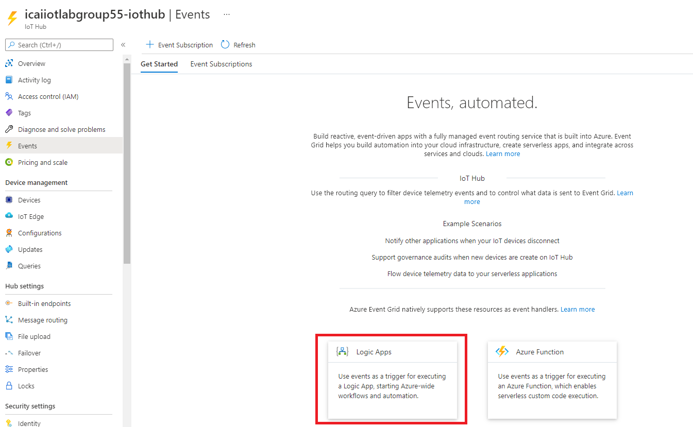
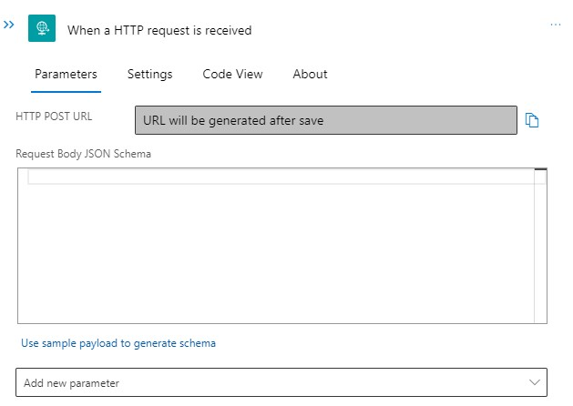
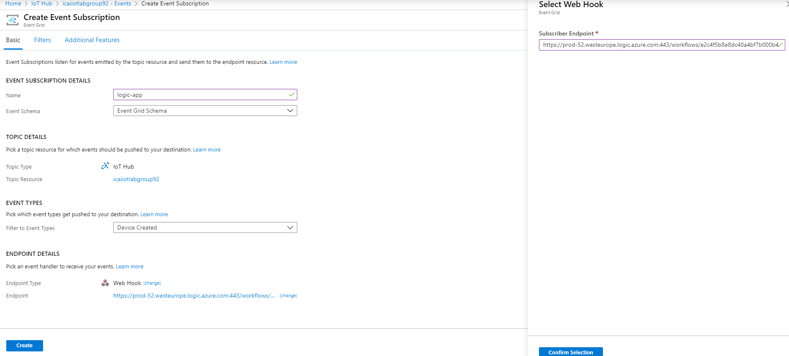

# React to Critical Device Lifecycle Events and Trigger Actions


Azure IoT Hub integrates with Azure Event Grid so that you can send event notifications to other services and trigger downstream processes. Configure your business applications to listen for IoT Hub events so that you can react to critical events in a reliable, scalable, and secure manner. For example, build an application to perform multiple actions like updating a database, creating a ticket, and delivering an email notification every time a new IoT device is registered to your IoT hub.

In this lab you will learn how to create logic app to be able to send twitter tweets

## Create Logic App from Azure IoT Hub

Navigate to your Azure IoT hub and select the option **Events** and click in **Logic Apps** as shown in the image below.



## Create a workflow within the Logic App
Once the Logic App instance has been created, select the option **+ Add** in the **Workflows** section on the blade

5. Click on the previously created workflow and add and HTTP **Request** trigger as shown below:


Azure Logic Apps is able to build the notification schema if provided with an exemplary JSON structure. 

7. For this, select **Use sample payload to generate schema** and paste the content in the JSON snippet below.



Copy and paste the following sample JSON.

```code
[{
  "id": "56afc886-767b-d359-d59e-0da7877166b2",
  "topic": "/SUBSCRIPTIONS/<Subscription ID>/RESOURCEGROUPS/<Resource group name>/PROVIDERS/MICROSOFT.DEVICES/IOTHUBS/<IoT hub name>",
  "subject": "devices/LogicAppTestDevice",
  "eventType": "Microsoft.Devices.DeviceCreated",
  "eventTime": "2018-01-02T19:17:44.4383997Z",
  "data": {
    "twin": {
      "deviceId": "LogicAppTestDevice",
      "etag": "AAAAAAAAAAE=",
      "status": "enabled",
      "statusUpdateTime": "0001-01-01T00:00:00",
      "connectionState": "Disconnected",
      "lastActivityTime": "0001-01-01T00:00:00",
      "cloudToDeviceMessageCount": 0,
      "authenticationType": "sas",
      "x509Thumbprint": {
        "primaryThumbprint": null,
        "secondaryThumbprint": null
      },
      "version": 2,
      "properties": {
        "desired": {
          "$metadata": {
            "$lastUpdated": "2018-01-02T19:17:44.4383997Z"
          },
          "$version": 1
        },
        "reported": {
          "$metadata": {
            "$lastUpdated": "2018-01-02T19:17:44.4383997Z"
          },
          "$version": 1
        }
      }
    },
    "hubName": "egtesthub1",
    "deviceId": "LogicAppTestDevice",
    "operationTimestamp": "2018-01-02T19:17:44.4383997Z",
    "opType": "DeviceCreated"
  },
  "dataVersion": "",
  "metadataVersion": "1"
}]
```

## Setup Notification by posting a Twitter Tweet

8. **Click on New Step**


9. **Add an action**


10. Choose **Gmail**
11. Select the action **Send email**.


12. Sign in to Gmail

## Create Email template ##
13. In the **To** field, put an email address that you use**
14. In the **Add new parameter** area, select Subject and Body, as shown below.


You can compose an email in the following window, using dynamic parameters, obtained from the received IoT event.


A result equivalent to the following image should be obtained. 


15. Click **Save**

## Copy Request URL

16. Once saved, click in the upper green box and copy the HTTPS URL


## Integrate With IoT Hub

17. Integrate Logic App with IoT Hub via the **Events** option in IoT Hub Menu, and click **Event Subscription**.


18. In this example, select:
* **Name** the event subscription **iot-hub**
* Select **Event Schema** to **Event Grid Schema**
* Configure **System Topic Name** to **iot-hub**
* Select **Endpoint Type** to **Web Hook** and Click **Select an endpoint**, where you will pase the HTTPS URL obtained in point 16
* Click **Create**



## Add Device and Test Notification

19. Go To IoTHub -> IoT Devices -> Add
* Add a device in IoT Hub as in previous modules.
* You Should get an email notification


If you have received an email as above, go to the next module.account.
[Go back to the main section](../README.md )
