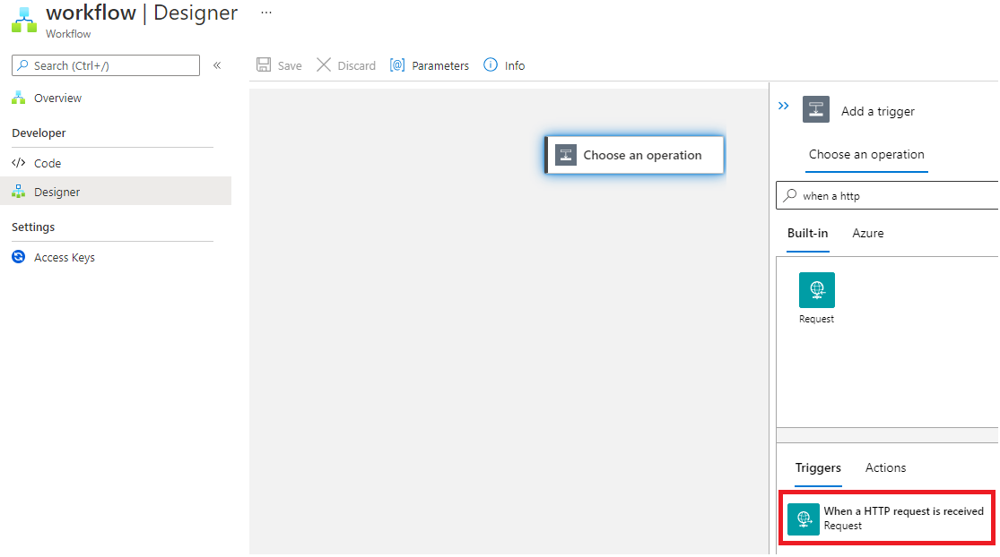

# React to Critical Device Lifecycle Events and Trigger Actions


Azure IoT Hub integrates with Azure Event Grid so that you can send event notifications to other services and trigger downstream processes. Configure your business applications to listen for IoT Hub events so that you can react to critical events in a reliable, scalable, and secure manner. For example, build an application to perform multiple actions like updating a database, creating a ticket, and delivering an email notification every time a new IoT device is registered to your IoT hub.

In this lab you will learn how to

* Create logic app to be able to send email notifications

* Create Event Grid

* Connect IoT Hub to Event Grid

## Create Logic App

Create a Logic App to be able to send email notifications

Select **Logic Apps** from the Azure resource explorer and click **Add**


Using **Logic App Designer**, Create **Blanck Logic App**


**Select HTTP Request** under the Request category



Azure Logic Apps is able to build the notification schema if provided with an exemplary JSON structure. 

For this, select **Use sample payload to generate schema** and paste the content in the JSON snippet below.


Copy and paste the following sample JSON.

```code
[{
  "id": "56afc886-767b-d359-d59e-0da7877166b2",
  "topic": "/SUBSCRIPTIONS/<Subscription ID>/RESOURCEGROUPS/<Resource group name>/PROVIDERS/MICROSOFT.DEVICES/IOTHUBS/<IoT hub name>",
  "subject": "devices/LogicAppTestDevice",
  "eventType": "Microsoft.Devices.DeviceCreated",
  "eventTime": "2018-01-02T19:17:44.4383997Z",
  "data": {
    "twin": {
      "deviceId": "LogicAppTestDevice",
      "etag": "AAAAAAAAAAE=",
      "status": "enabled",
      "statusUpdateTime": "0001-01-01T00:00:00",
      "connectionState": "Disconnected",
      "lastActivityTime": "0001-01-01T00:00:00",
      "cloudToDeviceMessageCount": 0,
      "authenticationType": "sas",
      "x509Thumbprint": {
        "primaryThumbprint": null,
        "secondaryThumbprint": null
      },
      "version": 2,
      "properties": {
        "desired": {
          "$metadata": {
            "$lastUpdated": "2018-01-02T19:17:44.4383997Z"
          },
          "$version": 1
        },
        "reported": {
          "$metadata": {
            "$lastUpdated": "2018-01-02T19:17:44.4383997Z"
          },
          "$version": 1
        }
      }
    },
    "hubName": "egtesthub1",
    "deviceId": "LogicAppTestDevice",
    "operationTimestamp": "2018-01-02T19:17:44.4383997Z",
    "opType": "DeviceCreated"
  },
  "dataVersion": "",
  "metadataVersion": "1"
}]
```

## Setup Notification by Sending Email 

**Click on New Step**


**Add an action**


Choose **Gmail**
Select the action **Send email**.


Sign in to Gmail

## Create Email template ##
In the **Add new parameter** area, select Subject and Body, as shown below.


You can compose an email in the following window, using dynamic parameters, obtained from the received IoT event.


A result equivalent to the following image should be obtained. 


## Copy Request URL


## Integrate With IoTHub

Integrate Logic App with IoTHub via Event Grid


Click on Event Subscription


Copy the URL from previous steps into Subscriber Endpoint and click create


## Add Device and Test Notification

Go To IoTHub -> IoT Devices (Device Management) -> Add


Click Save button to create a new device


You Should get an email notification


## Delete Device and Test Notification

Go To IoTHub -> IoT Devices (Device Management) -> Select Device you created in previous step -> Delete


You Should get an email notification


