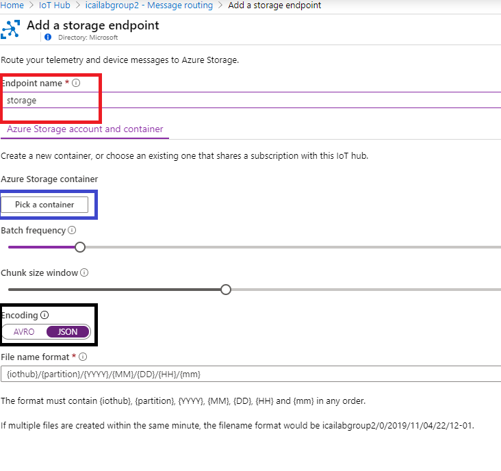
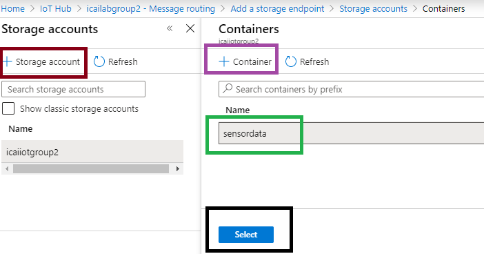
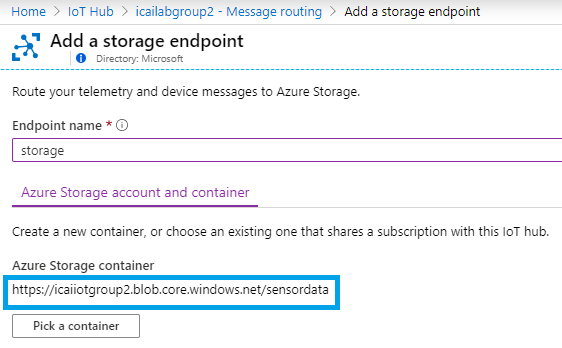

# Routing messages from Azure IoT Hub to an storage account
Azure IoT hub is intended to route messages, based on different conditions to different destionations. This capability is called message brokering. The following image shows this concept.

In this lab, we will store data in the previously created storage account, which is intended for storing massive ammount of data from millions of devices.
The outcome if this module is competing the end to end architecture presented.

## Creating a Custom Endpoint of type Storage under Azure IoT Hub routes

First we need to declare the previously created storage endpoint. Select **Message routing** (red), **Custom endpoints** (blue). Click **Add** (green) and select **Storage**, as shown in the diagram below.

Name the endpoint **storage** (internal name) as shown in red. Select **Encoding** in JSON for better human readability. Then click **Pick a Container** (Storage Container) created in the previous module, as shown below in blue.

In the menu displayed, click **Storage account** then add a container **+ Container** and **Select** the previously created container, as shown below:

Once the container has been properly selected, the container URL will be shown in the following window:

