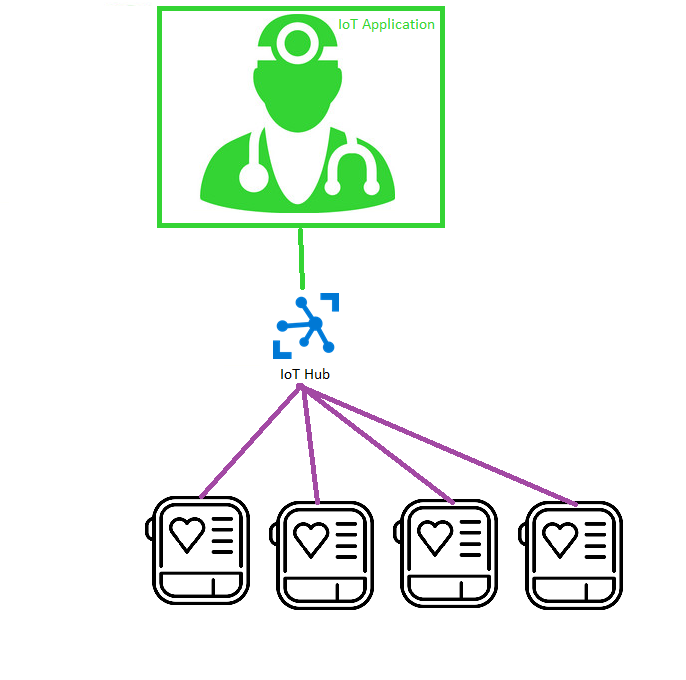
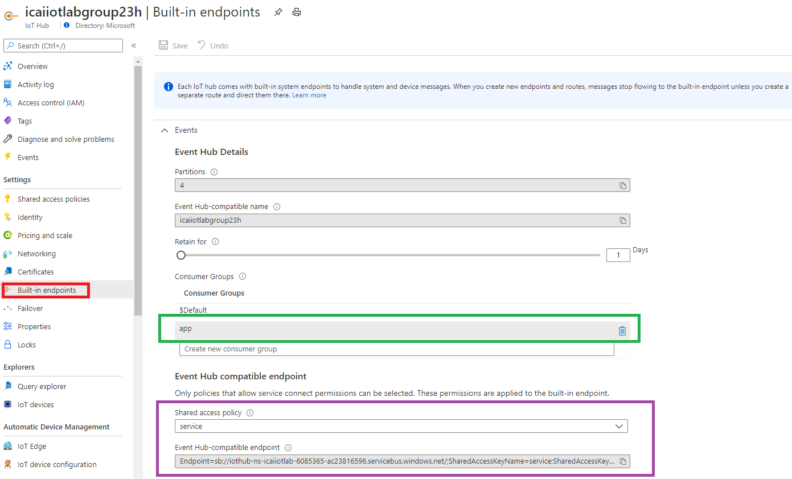
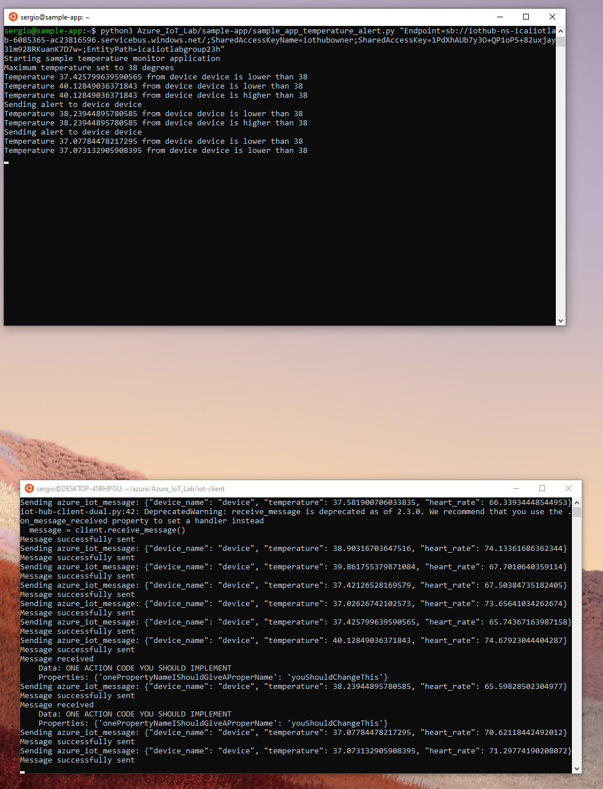

# Creating IoT applications

So far, we have seen different modules that highlight IoT application concepts for creating real IoT projects. This module will show a simple IoT application leveraging the concepts practiced so far in all previous modules.
We are going to build an application that gets health data from many devices and controls the monitored body temperature. 
For this module, we will focus on a single device, but the APP will scale to a large number of connecting devices, as depicted in the following image:



### Creating IoT applications
For this, create a sample VM as you did in module 2. Use the following command for installing the required packages:

```
sudo apt-get update -y
sudo apt install python3-pip -y
pip3 install azure-iot-device
pip3 install azure-iot-hub
pip3 install azure-eventhub
git clone https://github.com/SeryioGonzalez/Azure_IoT_Lab.git
```

In order to run the APP you need the IoT Hub built-in endpoint connection string. You can obtain it in the following window:
As highlighted in green, you need to create a consumer group for the APP, otherwise, it will conflict with other readers such as Azure Time Series Insights implemented in the previous module.
As highlighted in purple, select the **Shared access policy** type **service**

```
python3 Azure_IoT_Lab/sample-app/sample_app_temperature_alert.py "Endpoint=sb://iothub-ns-icaiiotlab-12345-ac23816596.servicebus.windows.net/;SharedAccessKeyName=service;SharedAccessKey=11232323232323232323;EntityPath=icaiiotlabgroup23h"
```



See in the capture below, you have a simulated device at the bottom as you did in lab 2 being controlled by an application:



The script for simulating a device that sends and receive messages is located [here](https://github.com/SeryioGonzalez/Azure_IoT_Lab/blob/master/iot-client/iot-hub-client-dual.py) <br/>
The script for simulating an application that send a message above a given temperature is located [here](https://github.com/SeryioGonzalez/Azure_IoT_Lab/blob/master/sample-app/sample_app_temperature_alert.py)

Good luck, have fun and do epic stuff!!
