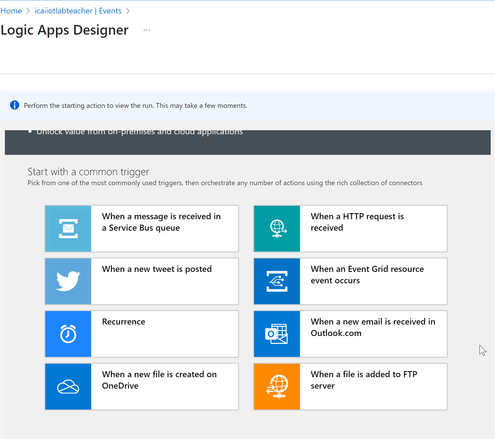
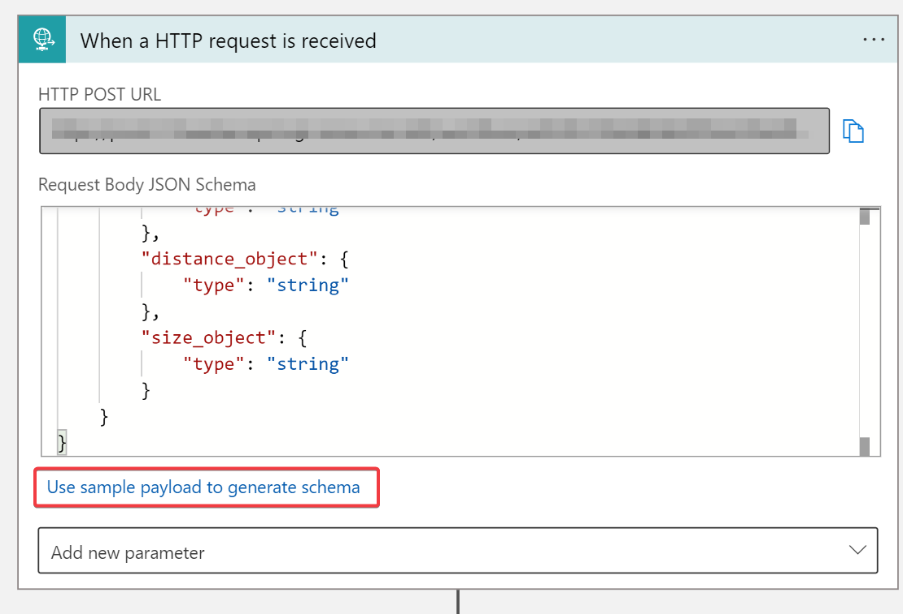
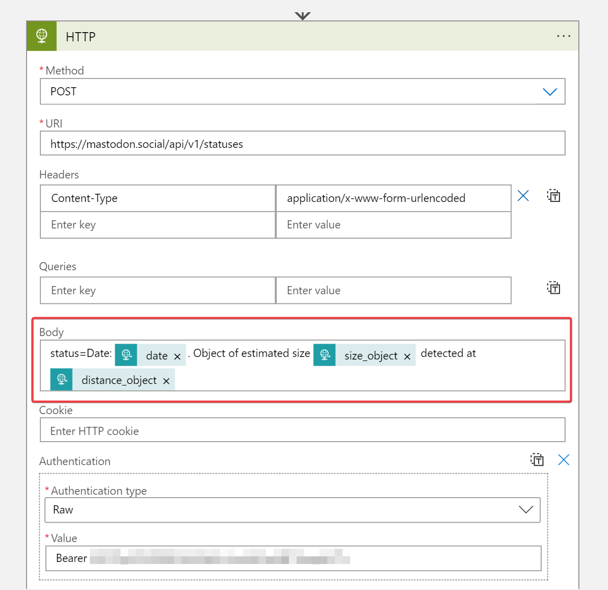
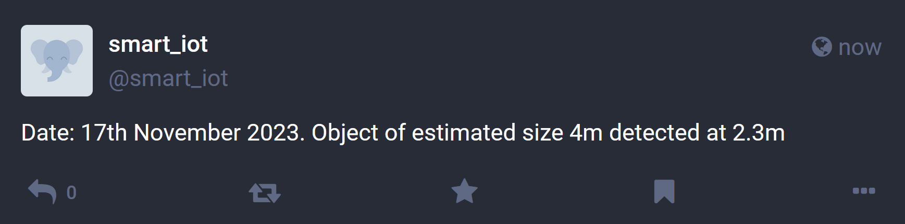

# Creating IoT applications

So far, we have seen different modules that highlight IoT application concepts for creating real IoT projects. This module will show a simple IoT application leveraging the concepts practiced so far in all previous modules.
We are going to build an application that gets health data from many devices and controls the monitored body temperature. 
For this module, we will focus on a single device, but the APP will scale to a large number of connecting devices, as depicted in the following image:


### Creating an IoT application that receive and sends messages to devices
In this module we are going to run a python script playing the role of a simulated sensor. Use the following command for installing the required packages in this new APP:

**For LINUX:**
```
sudo apt-get update -y
sudo apt install python3-pip -y
pip3 install azure-iot-device
pip3 install azure-iot-hub
pip3 install azure-eventhub
```

**For WINDOWS:**
```
python -m pip install azure-iot-device
python -m pip azure-iot-hub
python -m pip azure-eventhub
```

If you have not done it yet, clone this repository either by executing
```
git clone https://github.com/iiot-cloud-icai/Azure_IoT_Lab.git
```
Or by manually downloading the code from GitHub in the browser. 

In order to run the APP you need the IoT Hub built-in endpoint connection string. You can obtain it in the following window:
As highlighted in green, you need to create a consumer group for the APP, otherwise, it will conflict with other readers such as Azure Time Series Insights implemented before.
As highlighted in purple, select the **Shared access policy** type **service**


Copy the Event Hub-compatible endpoint and paste it when executing the `sample_app_temperature_alert.py` that simulates an application that send a message when the temperature received is above a given value. This script is located [here](https://github.com/iiot-cloud-icai/Azure_IoT_Lab/blob/master/sample-app/sample_app_temperature_alert.py)
```
python Azure_IoT_Lab/sample-app/sample_app_temperature_alert.py "you_event_Hub_compatible_endpoint"
```
At the same time, **you need to run** the script `iot-hub-client-dual.py` that represents a simulated device that sends measurements and receives messages from the previous script. For this, you need the connection string you used in previous modules. This script is located [here](https://github.com/iiot-cloud-icai/Azure_IoT_Lab/blob/master/iot-client/iot-hub-client-dual.py) <br/>

See in the capture below, top terminal window shows the execution of the `sample_app_temperature_alert.py`, whereas bottom window shows the execution of `iot-hub-client-dual.py`


### Integrating a Python APP with Azure Logic Apps (ALA) for executing workflows
Azure Logic Apps, used in module 8, is a highly versatile service that can be used to implement complex workflows. It has many connectors with 3rd party applications (Twitter, Office365, Gmail, custom webhooks, Microsoft Teams, Slack) allowing you create cool interactions. Please take a look at the Microsoft [Azure official documentation](https://docs.microsoft.com/en-us/azure/logic-apps/) and many available examples in the internet.

In the following example, we will implement an application that post information in Mastodon via a python script. This script could be running in sensor. 
We will trigger the application sending the following self explainatory parameters:
* date
* distance_object
* size_object

For initial steps, please create an Azure Logic App within your IoT Hub, just as you did in module 8. You should go to Templates when accessing the logic app designer, and select "When HTTP request is received". 



Open the "When HTTP request is received" box and click on "Use sample payload to generate schema". 
Copy and paste the following sample JSON.

```
 {
        "date": "17th November 2023",
        "distance_object": "2.3m",
        "size_object": "4m"
 }
```


The HTTP POST URL will be generated at the end, when saving the logic app

Once completed, we will select the subsequent operation. In this example, it is the same as in module 8: HTTP,as we will be posting to Mastodon again. Bear in mind that Azure has a lot of possible actions, such as sending an email using Gmail.<br/>

We will configure the HTTP box as we did in Module 8, although in this case the body of the message must contain the information we will send in the JSON with the Python script. 

Logic Apps creates some fields called **dynamic content** based on the input parameters in the API call definition you did in the previous block. Select the parameters **date**, **size_object** and **distance_object** and place them in the proper location.




Once configured, select **Save** and copy the HTTP POST URL, this will be the URL of the API to interact with the Azure logic app. When using the HTTP POST on this URL, it will trigger the Logic App workflow. 

The Python script we will use is `logic_app_launcher.py` located in the "sample-app" folder. Open it and change the parameter **api_endpoint** with the API URL of your workflow. 

Run the script and check that the information is being correctly posted in your Mastodon account, as shown below.



Good luck, have fun, your creativity is the limit and do epic stuff!!
