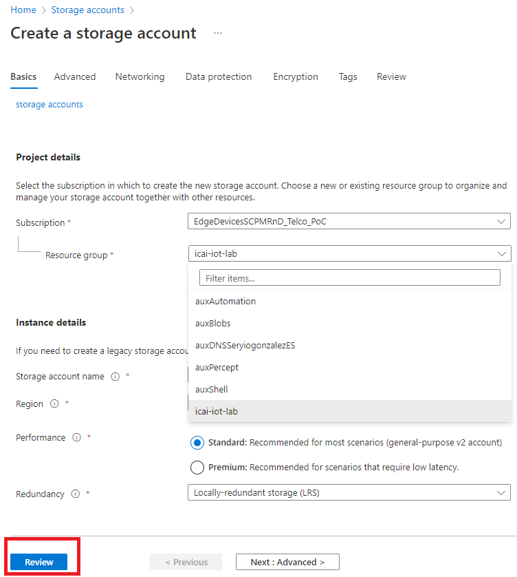
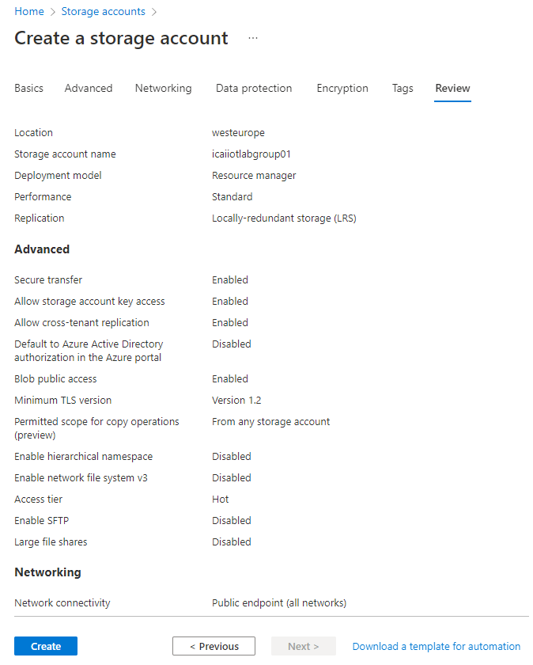
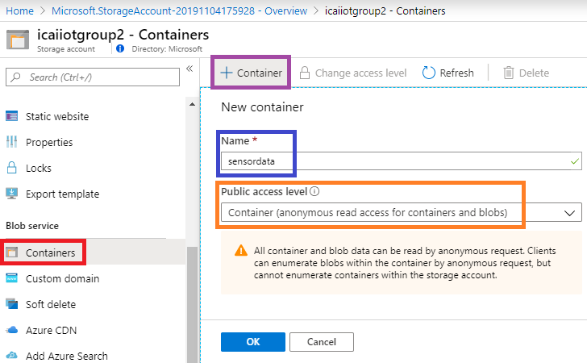

# Creating an Azure Blob Storage
In previous modules, we have set-up a simulated client sending traffic to an [Azure IoT Hub](https://docs.microsoft.com/en-us/azure/iot-hub/) (AzIoTH) instance. At this point, AzIoTH is not doing anything with that data, which obviously is not very useful.
Azure IoT Hub, apart from supporting device security and management, is a message broker capable of sending those IoT device messages to other services for consuming them.
In this lab, we will store those messages to an [Azure Blob Storage](https://docs.microsoft.com/en-us/azure/storage/blobs/storage-blobs-overview). Blob storage is a highly scalable cloud storage service, allowing massive data ingest at very low price 

## Create an Storage Account in the Azure portal

Look for **Storage Account** in the Azure Portal. Click "Add" in order to create your Storage Account. Use the resource group previously used and name the storage account **icaiiotgroupX**, where X is your group ID. Select **LRS** as Replication option. 

Once you click **Review + create**, a window similar to the one that follows will show up.
If the Validated message in green is displayed, press **Create**

## Create an Storage Container in the Storage Account

We are going to use blobs for storing sensor data. Blobs are stored in Containers. For this, we need to create a container. 
Select **Containers** as highlighted in red in the image below and click **+ Container** as shown in purple. Name the container **sensordata** as shown in blue. Set access level to Container (see in orange).

*For simplicity for this lab, considering we are not storing personal data, we can put access policy to anonymous.* *Never use anonymous access to a container hosting* **personal data** 

After clicking OK, this module is done. Go to the next module for continuing the lab and store sensor data in the blob
[Go back to the main section](../README.md )
