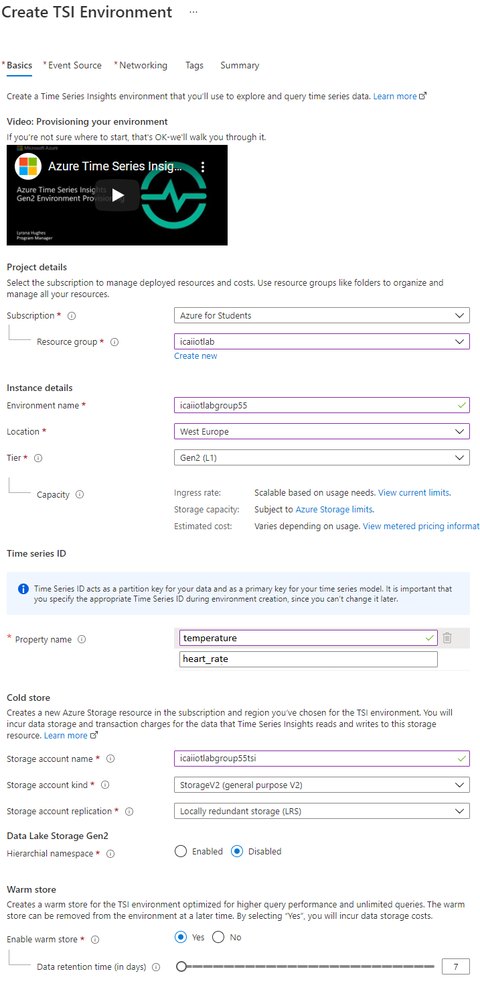

# Visualize Time Series Data with Azure Time Series Insights

Azure Time Series Insights is a fully managed analytics and visualization service for IoT-scale time-series data in the cloud. It enables you to explore and analyze billions of events streaming in from all over the world in seconds. Use Time Series Insights to store and manage terabytes of time-series data, explore and visualize billions of events simultaneously, conduct root-cause analysis, and to compare multiple sites and assets.

In this lab you will learn

* How to set up a Time Series Insights environment
* Explore and analyze time series data of your IoT solutions or connected things

## Configure a default route to the built-in endpoint

When you configured data routing to storage, IoT Hub disabled the default built-in endpoint. If we want data to appear in the built-in endpoint, we need to configure and explicit route, once custom routes have been added.

## Create Time Series Insights
Before creating the Time Series Insights environment, make sure you allow third-party cookies and to open pop-ups in your browser. In google chrome: 

1. Select **Time Series Insights environments** in the resource explorer search box of the Azure portal.
2. In the creation blade, select **Create**
3. Selecty the **Subscription** and **Resource Group** used in the lab
4. For **Environment name** select your group nickname **icaiiotlabgroupY** as resource name. 
5. Select the **Location** to **West Europe**.
6. For **Tier** select **Gen2 (L1)**
7. In the field **Property name** input **temperature** and **heart_rate**
8. Create a **Storage Account** using your group nickname and **tsi** at the end
9. Keep the rest options as they come
10. Click on **Next: Event Source >** for configuring the IoT Hub that will be sending data to this TSI instance

In the next blade, we are going to integrate the existing Azure IoT Hub: 

10. In **Create and event Source?** keep **Yes**
11. keep **Source Type** to **IoT Hub** 
12. Give a sample name **iot-hub** 
13. Select your **Subscription** and your existing **IoT Hub name** 
14. Select **IoT Hub access policy name** to **iothubowner** 
15. Select **IoT Hub consumer group** create a new entry to **tsi**
16. Keep the rest of the optionsd
17. Click **Create**

Once the deployment is complete, you will see the following image.

Select **Go to resource**

## Time Series Insights Explorer

In Azure Time Series Insights Explorer (AzTSIE) click in **Go to TSI Explorer** in the following image in order to see the explorer portal.

The AzTSIE allows correlating and visualazing data.  
For this, supposing you have sent traffic from the simulated device to Azure IoT Hub, implement a diagram like the one shown below.

Below, you can play with the style of the chart, change colors, layout, etc..
