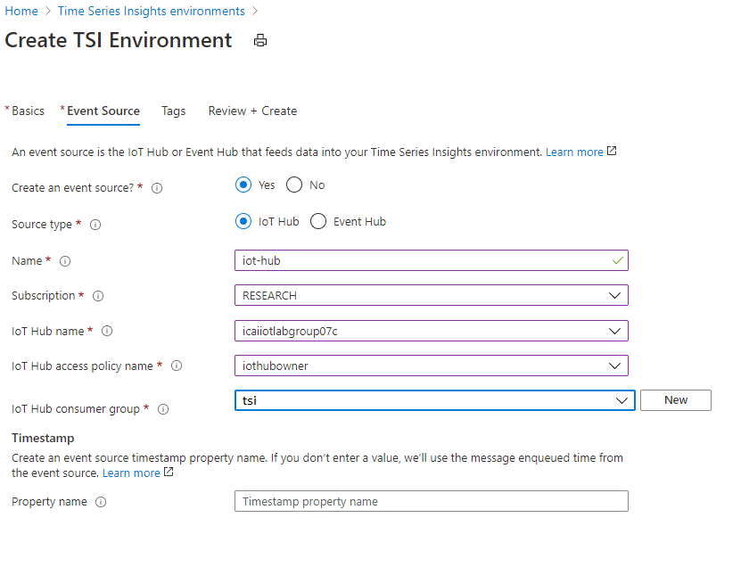

# Visualize Time Series Data with Azure Time Series Insights

Azure Time Series Insights is a fully managed analytics, storage, and visualization service for managing IoT-scale time-series data in the cloud. It provides massively scalable time-series data storage and enables you to explore and analyze billions of events streaming in from all over the world in seconds. Use Time Series Insights to store and manage terabytes of time-series data, explore and visualize billions of events simultaneously, conduct root-cause analysis, and to compare multiple sites and assets.

In this lab you will learn

* how to set up a Time Series Insights environment
* explore
* analyze time series data of your IoT solutions or connected things

## Create Time Series Insights

Select **Time Series Insights** in the resource explorer search box of the Azure portal.
Select your group nickname **icaiiotlabgroupX** as resource name. Place the resource in the lab resource group, so later deletion is easier and select the region to **West Europe**.

In the next blade, give a sample name **iot-hub** to the IoT Hub integration resource.
Select **Source Type** to **IoT Hub** and **Select existing** in the **Select a hub** option. Select your previously created Azure IoT Hub instance.
Additionally, select **IoT Hub access policy name** to **iothubowner** and **IoT Hub consumer group** to **$Default**.

You might not see data in Time Series Insights Explorer, since by it connects by default the built-in endpoint in Azur IoT Hub. Once we added a route in the previous lab for sending the sensor data to an storage, the built-in endpoint gets disable

[Routing behaviour with built-in endpoint in Azure IoT Hub](https://docs.microsoft.com/es-es/azure/iot-hub/iot-hub-devguide-messages-d2c#built-in-endpoint)

### Time Series Insights Explorer

Go To Time Series Insights Explorer

Split By ID. You will see data flowing from two devices. MXChip and Pi Simulator. 

Select humidity and Split By ID. You will see data flowing from two devices. MXChip and Pi Simulator.

Right Click to Explore events. You can download events in CSV and JSON format by clicking on **CSV or JSON** buttons

Create a perspective by clicking on the image shown below

Click **+** to add a new query

Select Temperature and split by Device ID and click on perspective image.

Create a chart by selecting a timeframe with drag feature

Create a Chart by adding a predicate

Perspective with 4 different charts and also changed Title

Click on Heatmap

View data in a table

